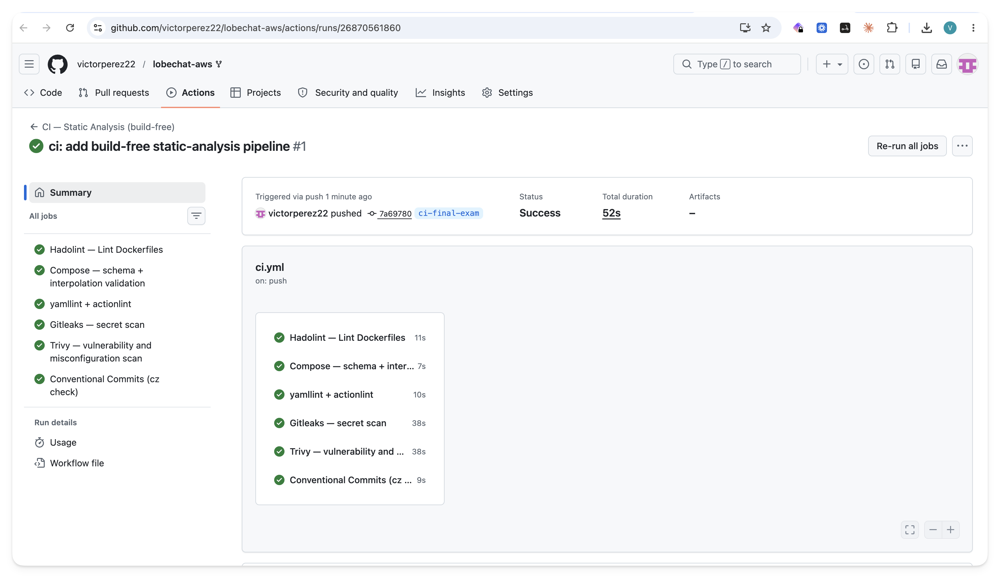

# CI Reasoning

## Evidence of Workflow Run

**Actions run URL:** https://github.com/victorperez22/lobechat-aws/actions/runs/26870561860

**Commit SHA this run executed against:** `7a69780d8beabbfe9adec2be4fe36d3c44bf7495`

**Result:** ✅ all 6 jobs succeeded, every gate executed (none skipped). The
findings-producing gates (hadolint, trivy, gitleaks, yamllint, actionlint) are
warn-only, so they surface their findings in the job logs without failing the
run; the two blocking gates (`docker compose config -q` and `cz check`) passed.

| Job                                          | Conclusion             |
| -------------------------------------------- | ---------------------- |
| Hadolint — Lint Dockerfiles (both)           | ✅ success (warn-only) |
| Compose — schema + interpolation (config -q) | ✅ success (blocking)  |
| yamllint + actionlint                        | ✅ success (warn-only) |
| Gitleaks — secret scan                       | ✅ success (warn-only) |
| Trivy — fs + config scan                     | ✅ success (warn-only) |
| Conventional Commits (cz check)              | ✅ success (blocking)  |

---

## Part A — Why what I did matters (repository-specific)

### 1. Hadolint on `dockerfiles/mcphub.Dockerfile` — unpinned base image and root privilege at runtime

**`dockerfiles/mcphub.Dockerfile` line 1:** `FROM samanhappy/mcphub:latest` is a floating tag on a
third-party image. Any future push to `:latest` by `samanhappy` could silently change the runtime
environment — introducing regressions, breaking changes, or malicious code — without any visible diff
in this repository. This is a direct supply-chain risk.

**`dockerfiles/mcphub.Dockerfile` line 5:** `USER root` is set before the `RUN` that installs
`graphviz`, `libgraphviz-dev`, `gcc`, and `docker.io` (line 7). Installing the Docker daemon socket
client (`docker.io`) and a C compiler (`gcc`) into a production runtime image gives any exploited
process inside the container full Docker socket access to the host and the ability to compile
arbitrary native code. Hadolint flags this as a hardening violation.

### 2. Hadolint on `dockerfiles/sandbox.Dockerfile` — supply-chain unpinning and NOPASSWD sudo

**`dockerfiles/sandbox.Dockerfile` line 21:** `echo 'oriol ALL=(ALL) NOPASSWD:ALL'` grants the
container user unrestricted passwordless root access via `sudo`. If any process inside the sandbox is
compromised, the attacker has full root without needing to bypass a password.

**`dockerfiles/sandbox.Dockerfile` lines 50 and 62:** Both `eksctl` and `zellij` are fetched from
`/releases/latest/download/` URLs:

- `https://github.com/eksctl-io/eksctl/releases/latest/download/eksctl_Linux_${ARCH}.tar.gz`
- `https://github.com/zellij-org/zellij/releases/latest/download/zellij-$Z.tar.gz`

There is no version pin and no checksum verification. A compromised upstream release replaces the
binary without any change to this Dockerfile. `kubectl` (line 43–44) fetches the version dynamically
at build time from `https://dl.k8s.io/release/stable.txt`, also with no checksum, so the installed
binary can vary between builds.

### 3. `docker compose config -q` — validates all 10 services without starting anything

**`docker-compose.yml`:** The Compose file defines 10 services: `casdoor`, `lobe-chat`, `mcphub`,
`qdrant`, `hayhooks`, `hayhooks-mcp`, `vllm`, `minio`, `linux-sandbox`, and `postgres`. Without a
`config -q` gate, a typo in an environment variable key, a malformed volume mount, or a YAML
indentation error would only surface at `docker compose up` time on the production server — after a
failed deployment. Running `config -q` in CI catches these errors on every push, before any code
reaches the server.

The `${NEXT_AUTH_SECRET}`, `${AUTH_CASDOOR_ID}`, `${AUTH_CASDOOR_SECRET}`, `${KEY_VAULTS_SECRET}`,
`${OPENROUTER_API_KEY}`, `${HF_TOKEN}`, `${SSH_HOST}`, `${SSH_USERNAME}`, and
`${OPENAPI_MCP_HEADERS}` variables are interpolated at config-evaluation time. The CI job copies
`.env.example` to `.env` (which is safe — see "Why the fix is safe" below) and appends
`OPENAPI_MCP_HEADERS=placeholder` for the one variable absent from `.env.example`, so `config -q`
passes with dummy values.

### 4. `trivy config` — real misconfigurations in the Compose file and Dockerfiles

**`docker-compose.yml` line 13:** The Casdoor service sets
`dataSourceName=...sslmode=disable dbname=casdoor`. This means all Postgres traffic from the Casdoor
SSO service travels in plaintext. On an AWS deployment where Casdoor and Postgres run on the same
host (connected via Docker's internal network), the risk is lower, but if the topology changes
(separate hosts, VPC routing) this becomes a data-in-transit exposure.

**`docker-compose.yml` lines 109 and 191:** `image: qdrant/qdrant:latest` and
`image: minio/minio:latest` are unpinned. These are production services storing vectors (Qdrant) and
S3 objects (MinIO) — a silent upstream `:latest` change could corrupt data or break the API. This is
distinct from the `mcphub` service (line 80 `image: lobechat-aws-mcphub:latest`), which is a
_locally built_ image produced by `dockerfiles/mcphub.Dockerfile`; the unpinned-pull risk for mcphub
lives in the `FROM samanhappy/mcphub:latest` in that Dockerfile, not in a pulled Compose image.

### 5. `gitleaks` — secret scan over full history

**`.gitignore` lines 14, 25, 26, 32:** `.env`, `aws_credentials.yaml`, `*.pem`, and `config/ssh/`
are all excluded by `.gitignore`. Because of this, on a clean working tree `gitleaks` should find
**no** committed secrets. The gate's value is as a safety net for accidental future leaks (e.g., a
developer forgets to add a new secret file to `.gitignore` and commits it). The `fetch-depth: 0`
checkout is required so gitleaks can scan the full git history, not just the tip commit.

### 6. `uv run cz check --rev-range origin/main..HEAD` — enforces Conventional Commits

**`.githooks/commit-msg`:** The repository's local commit hook runs
`uv run cz check --commit-msg-file "$1"` to validate every commit message before it is finalized.
This gate mirrors that check in CI: it uses `--rev-range origin/main..HEAD` instead of
`--commit-msg-file` (which requires a local file path only available in the hook context) so it
validates exactly the new commits on the branch without scanning pre-existing non-conventional commits
in the repo history.

---

### Why the pipeline is build-free

**`docker-compose.yml` lines 159, 179–181, 188:** The `vllm` service declares
`profiles: ["gpu"]`, `deploy.resources.reservations.devices: [driver: nvidia, count: 1]`, and
`healthcheck.start_period: 300s`. GitHub-hosted `ubuntu-latest` runners have no NVIDIA GPU. Even if
they did, the service takes up to 5 minutes just to pass its healthcheck, and `lobe-chat` depends on
it being healthy before starting. The full 10-service graph (with cross-service `depends_on` chains
for Postgres, Casdoor, MinIO, and vllm) takes many minutes to initialize on capable hardware. Running
`docker compose up` in CI would either time out or require a self-hosted GPU runner — neither is
acceptable for a fast, cheap static gate.

### Why `tests/` are excluded

`tests/test_vllm.py` imports `httpx` and `openai` (lines 9, 11) and hits
`http://vllm:8000/health` (line 33) — a live running endpoint. Similarly,
`tests/test_mcp_aws_resources.py` connects to the MCPHub service via a running MCP session. These
are **live-stack integration tests**, not unit tests. They require the full stack to be running and
healthy; they cannot execute in a build-free pipeline that starts no containers.

### Why the Compose interpolation fix is safe

**`.gitignore` line 14:** `.env` is listed in `.gitignore`. The CI step `cp .env.example .env`
creates a `.env` file in the runner's workspace at job runtime; because `.gitignore` ignores it, this
file can never be staged or committed — not on the runner, and not if a developer runs the same
command locally. **`.env.example` contains only placeholder values** (e.g.
`KEY_VAULTS_SECRET=Y2hhbmdl...`, `OPENROUTER_API_KEY=sk-or-v1-your-openrouter-api-key`), not real
secrets. No real secrets are ever present in CI.

**Clarification:** `gitleaks` does **not** find any committed secrets in this repository. `.gitignore`
excludes `.env`, `aws_credentials.yaml`, `*.pem`, and `config/ssh/` before they could ever be
committed. The gate's purpose is to catch future accidents, not current leaks.

---

## Part B — What is missing for a real production CI/CD (delivery) pipeline

What I built is **Continuous Integration**: a set of static quality and security gates that run on
every push and pull request. It stops well short of **Continuous Delivery/Deployment**. CI verifies
that the code is safe to merge; CD delivers the merged code to users. The pipeline built here never
touches a server, never moves an artifact, and never changes the running system.

Below are the concrete additions required to close the CI → CD gap for this specific repository.

---

### 1. Build, push, and pin the locally-built images to a registry

**`docker-compose.yml` mcphub service (build at lines 77–80) + `dockerfiles/mcphub.Dockerfile`** and
**`docker-compose.yml` linux-sandbox service (build at lines 211–214) + `dockerfiles/sandbox.Dockerfile`:**
Both services are built locally from Dockerfiles (`build: context: . dockerfile: dockerfiles/...`).
A real CD pipeline would build these images, tag them with the commit SHA, push them to a registry
(e.g. Amazon ECR), and rewrite the `image:` tags in the Compose file to the pushed digest. Without
this, the deploy is not reproducible — two deploys from the same commit can produce different
containers if upstream base images changed.

At the same time, the unpinned pulled images (`qdrant/qdrant:latest` at line 109,
`minio/minio:latest` at line 191) should be resolved to immutable digests so every deploy uses
exactly the same bits.

### 2. GitHub OIDC federation instead of the `~/.aws` bind-mount

**`docker-compose.yml` mcphub service, line 103:** `- ~/.aws:/root/.aws:ro` bind-mounts the host's
AWS credential files directly into the container. **`.env.example` lines 61–62** show commented
`AWS_ACCESS_KEY_ID` / `AWS_SECRET_ACCESS_KEY` / `AWS_SESSION_TOKEN` placeholders, indicating
long-lived static keys were the original credential path.

A real CD pipeline would configure GitHub OIDC to let the Actions workflow assume an IAM role
directly — no standing credentials stored on the deploy host or in CI secrets. This eliminates the
blast radius of a compromised `~/.aws` directory and removes the manual rotation burden of
long-lived keys.

### 3. Secret injection from AWS SSM Parameter Store / Secrets Manager at deploy time

**`docker-compose.yml` lobe-chat service environment:** `NEXT_AUTH_SECRET=${NEXT_AUTH_SECRET}`,
`AUTH_CASDOOR_ID=${AUTH_CASDOOR_ID}`, `AUTH_CASDOOR_SECRET=${AUTH_CASDOOR_SECRET}`,
`KEY_VAULTS_SECRET=${KEY_VAULTS_SECRET}`. All of these are currently sourced from a `.env` file on
the host. A real pipeline would fetch them from AWS SSM Parameter Store or Secrets Manager at deploy
time (per the final-project §2.2 requirement), inject them as environment variables into the
Compose process, and never store them in a file on disk or in CI secrets.

### 4. Database migration stage with a guarded `clean` command

**`db/flyway/provision.sh` line 10:** `./db/flyway/provision.sh clean` — documented as
"DROP all rows + reset history" — is a destructive operation that irrevocably deletes all data. A
real CD pipeline would run migrations (`provision.sh` without `clean`) automatically as part of every
deploy, but gate the `clean` subcommand behind a manual approval step (e.g. a GitHub Environment
protection rule requiring a human to approve before the step runs).

### 5. Environment promotion: dev → stage → prod with manual approval

Today there is a single environment (the EC2 host). A real pipeline for this repository would define
at least three GitHub Environments (dev, stage, prod), run the full CI suite on dev, promote to stage
automatically, and require manual approval before promoting to prod. This matches the final-project
Q2 promotion flow and prevents untested changes from reaching production.

### 6. Post-deploy smoke tests and health gates against an ephemeral environment

**`tests/test_vllm.py` line 33** (`httpx.get(f"{base_url}/health")`),
**`tests/test_mcp_aws_resources.py`**, **`tests/test_mcp_playwright.py`**: these live-stack
integration tests are currently excluded from CI because they need a running stack. A real CD
pipeline would spin up an ephemeral environment (e.g. a temporary EC2 instance or ECS cluster), run
`docker compose up -d`, wait for all services to be healthy, then execute `uv run --group test pytest
tests/` against that environment. If tests pass, promote; if not, tear down and fail the pipeline.

Several services (mcphub, casdoor, hayhooks, hayhooks-mcp) also lack `healthcheck:` definitions in
`docker-compose.yml`, meaning `depends_on: condition: service_healthy` cannot be used for them.
Adding healthchecks to all services is a prerequisite for reliable post-deploy gating.

### 7. Automated rollback and immutable image references

**`docker-compose.yml` lobe-chat service, line 25–26:** A previous version of the deploy used a
`patches/route.js` monkeypatch bind-mounted into the container
(`./patches/route.js:/app/.next/server/app/(backend)/trpc/tools/[trpc]/route.js:ro`). Even though
this mount is currently disabled (see the comment in the compose file), the pattern of bind-mounting
a committed blob as a runtime override makes rollback unreliable — reverting the image does not
revert the mounted file. A real pipeline would bake the patch into a versioned, forked image at build
time and reference it by digest, so rolling back the image digest is a complete rollback.

### 8. Branch protection and required status checks

No branch protection rules exist on `main` today. Any push goes directly to `main` without review or
CI gate enforcement. A real pipeline would require:

- All CI jobs in this workflow to pass before a PR can be merged (required status checks)
- At least one reviewer approval
- Signed and annotated release tags produced by `uv run cz bump` before any deploy to production

---

### Prioritisation: the single highest-value next step

**GitHub OIDC federation + ECR image push** is the highest-value immediate step toward real CD for
this system. The `~/.aws` bind-mount (docker-compose.yml line 103) means AWS credentials exist as
files on the deploy host — a credential leak or host compromise gives an attacker full AWS access
with no expiry. At the same time, deploying from unpinned images (`:latest` for qdrant, minio, and
the base images in both Dockerfiles) means no two deploys are identical, making rollback and
incident diagnosis extremely difficult. Solving both together — OIDC for credential-free CI/CD and
ECR with digest-pinned image references for reproducibility — removes the two highest-severity risks
(standing credentials and non-reproducible deployments) in a single pipeline addition, and directly
unlocks the environment-promotion and rollback capabilities that all subsequent CD improvements
depend on.
